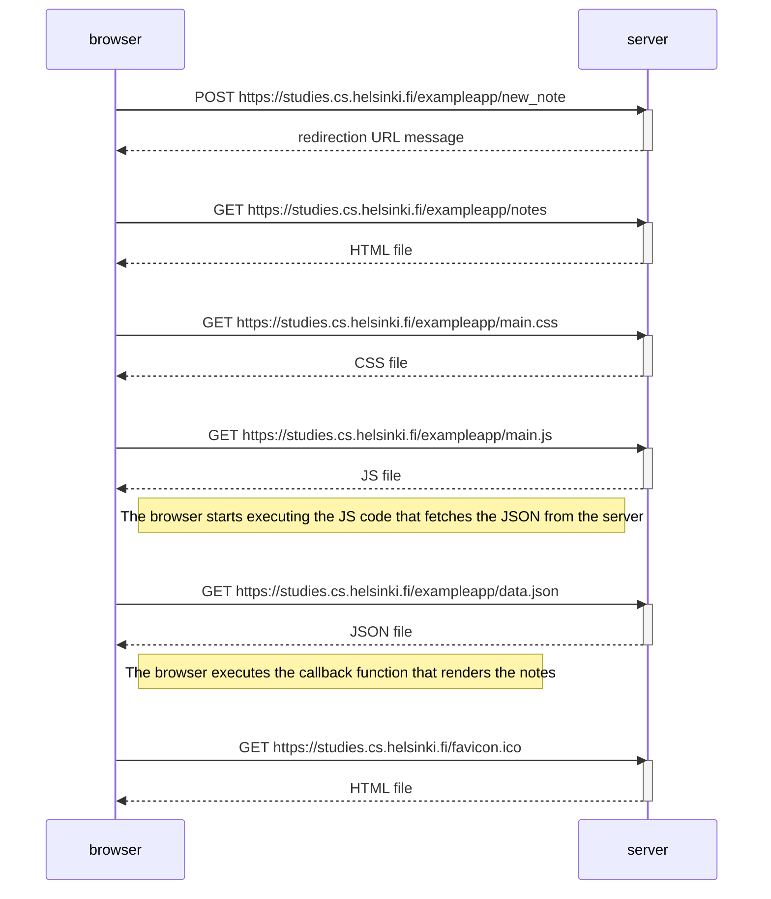

```mermaid
sequenceDiagram
participant browser
participant server
browser ->> server:POST https://studies.cs.helsinki.fi/exampleapp/new_note
activate server
server-->> browser: redirection URL message
deactivate server

browser ->> server:<br/><br/>GET https://studies.cs.helsinki.fi/exampleapp/notes
activate server
server-->> browser: HTML file
deactivate server


browser ->> server:<br/><br/>GET https://studies.cs.helsinki.fi/exampleapp/main.css
activate server
server-->> browser: CSS file
deactivate server

browser ->> server:<br/><br/>GET https://studies.cs.helsinki.fi/exampleapp/main.js
activate server
server-->> browser: JS file
deactivate server
Note right of browser: The browser starts executing the JS code that fetches the JSON from the server


browser ->> server:<br/><br/> GET https://studies.cs.helsinki.fi/exampleapp/data.json
activate server
server-->> browser: JSON file
deactivate server
Note right of browser: The browser executes the callback function that renders the notes

browser ->> server:<br/><br/>GET https://studies.cs.helsinki.fi/favicon.ico
activate server
server-->> browser: HTML file
deactivate server
```